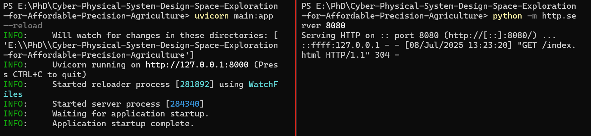
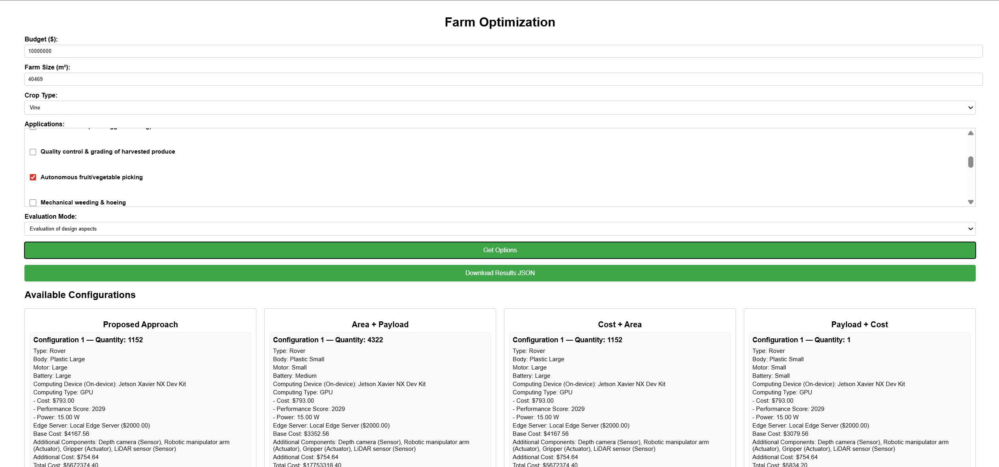

# Overview
This is our repository of the working implementation of our proposed approach for the paper *"Cyber-Physical System Design Space Exploration for Affordable Precision Agriculture."*

Please download the spreadsheet file containing data and references to build the database. 
[Spreadsheet](database_with_references.xlsx)

Evaluation results of
1) Evaluation of design aspects:
[Case Study 1](Plots/Evaluation_of_design_aspects/Tree_500000_4047_General-crop-monitoring_Yield-estimation-(fruit-veggie-counting)/README.md)
and
[Case Study 2](Plots/Evaluation_of_design_aspects/Vine_10000000_40469_Autonomous-fruit-vegetable-picking/README.md)
2) Optimizer model evaluation:
[Case Study 1](Plots/Optimizer_model_evaluation/Tree_500000_4047_General-crop-monitoring_Yield-estimation-(fruit-veggie-counting)/README.md)
and
[Case Study 2](Plots/Optimizer_model_evaluation/Vine_10000000_40469_Autonomous-fruit-vegetable-picking/README.md)
# Prerequisites 

You need to **download this repository** and have **python installed**, as the main scripts are written in Python.

## Library Dependencies
The following dependencies are required to run this project.
  
```
pip install -r requirements.txt
```
### To run the code 
Open two terminals go to the path of the Webpage ILP directory and run
```
uvicorn main:app --reload

python -m http.server 8080
```
The image below displays the terminal after entering the two commands above.




Enter ``` http://127.0.0.1:8080/ ``` in the web browser to access the webpage.

### Additional Instructions
You need to enter the values of **budget, farm size, select crop type** from the dropdown, and select **at least 1 application** to get the results. 

You can check **Evaluation of design aspects** or **Optimizer model evaluation** by selecting it in the evaluation mode dropdown. 


The image below displays the webpage with inputs from case study 2.




### Verification Instructions

After getting the results on the webpage, you can verify the solver outputs:

1. Use the **Download Results JSON** button on the webpage to export the results.  
2. Save the file as `results.json` in the root directory of this repository.  
3. Run the verification script: 
```
python verify_ilp.py
``` 
4. The script will check that the configurations satisfy the budget and farm size constraints.
